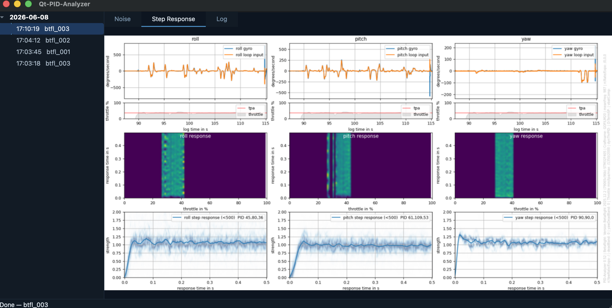

# Qt-PID-Analyzer

> [Ukrainian version → README.md](README.md)



A Qt desktop application for analysing Betaflight blackbox logs.

A graphical wrapper around [PID-Analyzer](https://github.com/bioname/PID-Analyzer)
with a session tree, drag-and-drop input and a built-in result viewer.

---

## What it does

1. Drop a `.BBL` / `.BFL` log file onto the left panel.
2. The app copies it into its own storage (`data/logs/YYYY-MM-DD/HHMMSS_<name>/`).
3. `blackbox_decode` and `PID-Analyzer.py` run in a background thread.
4. Results appear in three tabs on the right:
   - **Noise** — noise plot
   - **Step Response** — PID step-response plot
   - **Log** — plain-text analyser output


## Repository layout

```raw
Qt-PID-Analyzer/
├── app/
│   ├── main.py          # QApplication + dark palette
│   ├── mainwindow.py    # main window, splitter
│   ├── log_tree.py      # session tree (drag & drop, right-click Delete)
│   ├── plot_viewer.py   # three-tab result viewer
│   ├── worker.py        # QThread background analysis
│   └── storage.py       # session folder management
├── vendor/
│   ├── PID-Analyzer/    # git submodule
│   └── blackbox-tools/  # git submodule
├── data/logs/           # session storage (not tracked by git)
├── bin/                 # compiled blackbox_decode (not tracked by git)
├── scripts/
│   ├── build_blackbox.sh   # build for macOS / Linux
│   ├── build_blackbox.bat  # build for Windows (MinGW)
│   └── check_deps.py       # pip-free dependency checker
├── run.py               # entry point
├── requirements.txt
└── pyproject.toml
```


## Requirements

- **Python 3.8+** — the only mandatory dependency
- **gcc / make** — macOS and Linux only (to build `blackbox_decode`)
  - macOS: `xcode-select --install`
  - Linux: `gcc make` (available in any distro)
- **Windows**: no gcc needed — `run.py` downloads a pre-built `blackbox_decode.exe` automatically
- **git**: optional — you can simply download the ZIP from GitHub


## Installation & running

### Option A — download ZIP (easiest, no git required)

1. Click **Code → Download ZIP** on the [repository page](https://github.com/bioname/Qt-PID-Analyzer)
2. Extract the archive
3. Launch:

```bash
python3 run.py          # macOS / Linux
python  run.py          # Windows
```

### Option B — via git

```bash
git clone --recurse-submodules https://github.com/bioname/Qt-PID-Analyzer
cd Qt-PID-Analyzer
python3 run.py
```

---

On the **first launch** `run.py` automatically:
- Creates `.venv/` and installs all Python dependencies
- Downloads `vendor/PID-Analyzer` and `vendor/blackbox-tools` (if not cloned via git)
- **Windows**: downloads a pre-built `blackbox_decode.exe` from GitHub Releases
- **macOS / Linux**: builds `blackbox_decode` from source (`gcc` required)
- Re-executes itself under the venv Python and opens the window

Every **subsequent** launch opens the window immediately.


## Gentoo (no pip)

```bash
# Install via portage
emerge dev-python/PyQt6 dev-python/numpy dev-python/scipy \
       dev-python/pandas dev-python/matplotlib dev-python/six

# Launch — bootstrap finds packages through system-site-packages
python3 run.py
```

Or check dependencies manually:
```bash
python3 scripts/check_deps.py
```


## Usage

| Action | Result |
|---|---|
| Drag & drop `.BBL` onto the left panel | Starts analysis |
| Click a session in the tree | Opens its results |

| Right-click a session → Delete | Removes session and its files |```

GPLv3 — inherited from `blackbox-tools` and the original `PID-Analyzer`.


## Submodules## License


| Submodule | Repository | Purpose |

|---|---|---|| `vendor/blackbox-tools` | [cleanflight/blackbox-tools](https://github.com/cleanflight/blackbox-tools) | `.BBL` to `.CSV` decoder |
| `vendor/PID-Analyzer` | [bioname/PID-Analyzer](https://github.com/bioname/PID-Analyzer) | Python analyser |